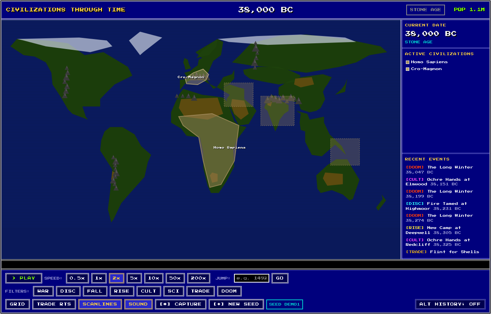
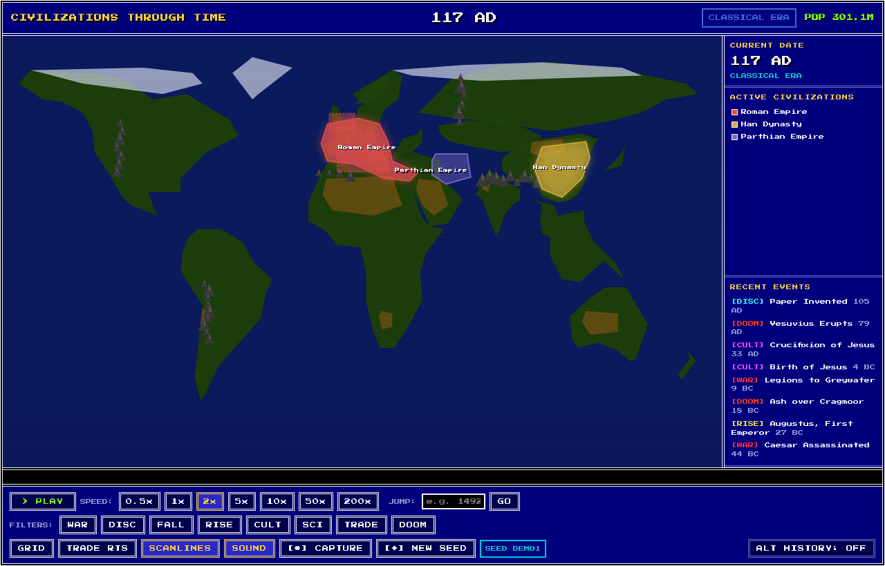
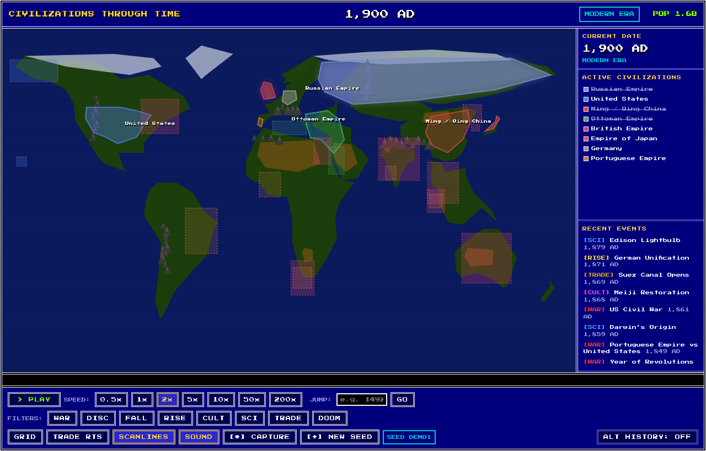
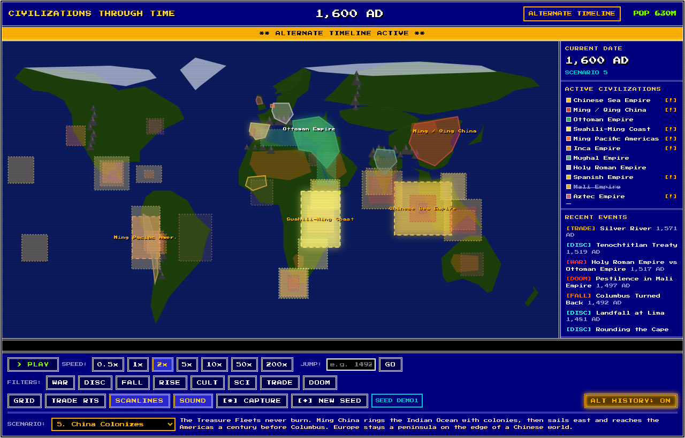

# Civilizations Through Time

A 1990s DOS-style (Civilization I / Colonization) browser simulation of the rise
and fall of human civilizations from 40,000 BC to 2025 AD. Pixel font, double-line
borders, VGA colors, CRT scanlines, retro bleeps, a scrolling news ticker, and a
full Alternate-History mode.

## Run it

Just open `index.html` in a browser. No build step, no server, works offline:

```
open index.html
```

It uses classic `<script>` tags (not ES modules) and a self-hosted pixel font, so
double-clicking the file over `file://` works.

## Screenshots

| | |
|---|---|
|  |  |
|  |  |

## Controls

- **Space** play / pause, **+ / -** speed, **left / right** step +/- 500 years
- **Home / End** jump to 40,000 BC / 2025 AD, **R** (while paused) random event, **Esc** close popup
- Click a territory for its info card. Buttons: speed, jump-to-year, event-type
  filters, GRID, TRADE ROUTES, SCANLINES, SOUND, CAPTURE (PNG), NEW SEED, ALT HISTORY.

## "Different every time"

Real history (civ rise/fall years and the famous canonical events) is accurate and
fixed. On top of it a **seeded** layer is regenerated each load: ~260 flavor events
(festivals, omens, plagues, harvests, skirmishes), emergent neighbor-wars, golden
ages, comets, and per-civilization territory variation. Same true history, fresh
texture every run. `[+] NEW SEED` re-rolls it.

## Deep-link / share params

- `?seed=CODE` reproduce an exact run (the active seed shows bottom-right)
- `?year=1492` open at a year (negative = BC, e.g. `?year=-3000`)
- `?alt=2` start in Alternate-History scenario N (1-10)
- `?paused=1` open paused
- `?burn=N` developer self-test: synchronously run N frames and report to `body[data-burn]`

## Alternate History

Ten divergence scenarios (Alexander Lives, Rome Never Falls, Mongols Conquer All,
No Black Death, China Colonizes, Aztec Survives, No WWI, Axis Victory, Nuclear
Exchange, USSR Survives). Toggling on rewinds to the divergence year; toggling off
restores where you were. Counterfactual civs render with dashed borders; the whole
UI shifts to an amber theme. Alt history is a **pure derived layer** -- base data is
never mutated.

## Project layout

```
index.html            shell + script order
css/style.css         DOS chrome
fonts/                self-hosted Press Start 2P
js/
  core.js             namespace, palette, config, central state
  rng.js              seeded PRNG (mulberry32)
  geo.js              equirectangular projection, continents, landmark table
  data-*.js           civs, eras, events (+ generated extras), trade, flavor, alt-history
  sim.js              time advance, population/era/growth (pure, tested)
  althistory.js       effectiveCivs() derivation + rewind/restore state machine
  procedural.js       the seeded variation layer
  audio.js            Web Audio square-wave bleeps
  render.js           canvas: cached static terrain + dynamic civs/fx
  ui.js               DOM chrome, ticker, info popup, event firing
  input.js            keyboard + mouse
  main.js             boot splash, rAF loop, control actions
tests/engine.test.js  pure-logic + regression tests (node --test)
```

## Tests

```
node --test
```

Covers population interpolation, era boundaries, growth, RNG determinism, the
alt-history derivation (and that it never mutates base data), the rewind/restore
state machine, and regressions for the alt-event location + divergence-boundary bugs.

## Regenerating data

The flavor pool, prehistory/enrichment events, and alt-history scenario data in
`js/data-flavor.js`, `js/data-events-extra.js`, and `js/data-althistory.js` are
generated content embedded as JS. They are committed; no regeneration is needed to
run the app.
